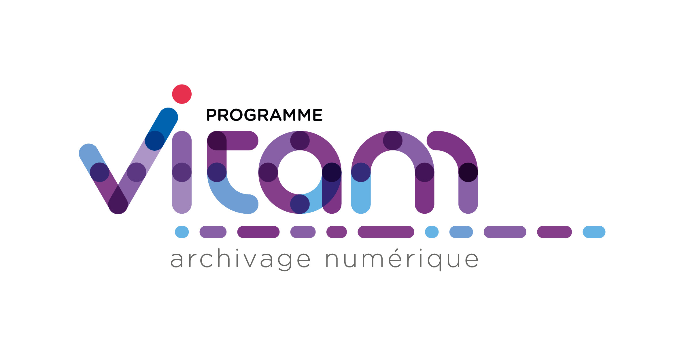

#####
VITAM
#####

Le programme interministériel Vitam
===================================

Il a pour objectif :

* la conception, la réalisation et la maintenance mutualisées d’une solution logicielle générique d’archivage électronique. Cette solution logicielle est appelée Vitam ;
* la mise en place ou la mise à jour, dans chacun des trois ministères porteurs, de plates-formes d’archivage utilisant la solution logicielle Vitam ;
* la réutilisation de la solution logicielle Vitam par le plus grand nombre d’acteurs publics possible, en veillant à sa capacité d'usage dans des contextes divers.

Ce dépôt est celui qui permet de générer le site statique associé au code développé dans le cadre du programme. Il s'agit d'un site Jekyll dont le squelette est tiré du modèle Hyde (Copyrigth 2013 Mark Otto) et publié comme GitHub Pages sur l'adresse `www.programmevitam.fr <http://www.programmevitam.fr>` ou encore `programmevitam.github.io <http://programmevitam.github.io>`
